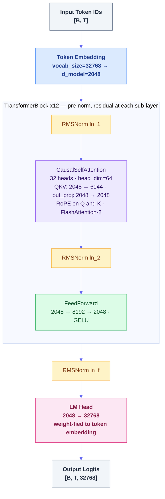

# llm-training

[](https://github.com/objones25/llm-training/actions/workflows/ci.yml)
[](https://github.com/objones25/llm-training/actions/workflows/model-tests.yml)
[](https://github.com/objones25/llm-training/actions/workflows/docker.yml)

A small GPT-style language model trained on [fineweb-edu](https://huggingface.co/datasets/HuggingFaceFW/fineweb-edu) (sample-10BT), built incrementally for learning purposes.

## Architecture

A decoder-only GPT transformer with **12 layers**, **2 048-dimensional** residual stream, and **32 768-token** vocabulary — approximately 604 M non-embedding parameters at full scale.



| Parameter            | Value  |
| -------------------- | ------ |
| `n_layers`           | 12     |
| `d_model`            | 2 048  |
| `n_heads`            | 32     |
| `head_dim`           | 64     |
| `d_ff`               | 8 192  |
| `vocab_size`         | 32 768 |
| `seq_len`            | 1 024  |
| Non-embedding params | ~604 M |

**Key design choices:**

- **RoPE** — rotary position embeddings applied to Q & K inside each attention layer; no separate position embedding table. Allows length generalisation at inference.
- **RMSNorm** — pre-norm before each sub-layer (attention and FF). Omits mean subtraction and bias; slightly faster than LayerNorm with equivalent quality.
- **FlashAttention-2** — `scaled_dot_product_attention(is_causal=True)` dispatches to FlashAttention-2 on CUDA automatically; no custom kernel needed.
- **Weight tying** — `lm_head.weight` is tied to `token_embedding.weight`, halving the embedding parameter count (GPT-2 style).
- **KV cache** — two-phase (prefill + generate) inference via `src/kv_cache.py`; no architectural changes required between training and generation.

---

## Setup

```bash
uv sync
```

---

## Scripts

### 1. Train the tokenizer

Streams documents from fineweb-edu and trains a ByteLevel BPE tokenizer. Never loads the full dataset into memory.

```bash
uv run python scripts/train_tokenizer.py
```

**Options:**

| Flag               | Default                     | Description                                |
| ------------------ | --------------------------- | ------------------------------------------ |
| `--vocab-size`     | `32768`                     | Target vocabulary size                     |
| `--max-docs`       | `500000`                    | Number of documents to stream for training |
| `--output`         | `tokenizer.json`            | Output path for the saved tokenizer        |
| `--dataset-name`   | `HuggingFaceFW/fineweb-edu` | HuggingFace dataset name                   |
| `--dataset-config` | `sample-10BT`               | Dataset config/subset name                 |
| `--dataset-split`  | `train`                     | Split within the dataset config            |

**Example — smaller vocab for a quick experiment:**

```bash
uv run python scripts/train_tokenizer.py --vocab-size 4096 --max-docs 50000 --output tokenizer_small.json
```

Training 200k documents takes a few minutes. The output is a single JSON file that can be loaded with `BPETokenizer.load("tokenizer.json")`.

---

### 2. Pre-tokenize the dataset

Streams the full dataset, encodes every document, and writes two binary files (`train.bin` / `val.bin`) to disk as raw `uint16` arrays. This is a one-time preprocessing step — the training loop reads from these files directly via `numpy.memmap`.

Requires a tokenizer trained in step 1.

```bash
uv run python scripts/pretokenize.py --tokenizer tokenizer.json
```

**Options:**

| Flag              | Default                     | Description                                                                             |
| ----------------- | --------------------------- | --------------------------------------------------------------------------------------- |
| `--tokenizer`     | _(required)_                | Path to a tokenizer JSON from step 1                                                    |
| `--seq-len`       | `1024`                      | Fixed sequence length for each chunk                                                    |
| `--val-every`     | `100`                       | Route every Nth document to the val split (~1% val)                                     |
| `--output-dir`    | `data`                      | Directory for `train.bin` and `val.bin`                                                 |
| `--hf-cache-dir`  | _(system default)_          | Redirect HF shard cache (sets `HF_HOME`). Use on cloud pods to avoid `/root` disk-full. |
| `--dataset-name`  | `HuggingFaceFW/fineweb-edu` | HuggingFace dataset name                                                                |
| `--dataset-split` | `sample-10BT`               | Dataset split                                                                           |

**Example — custom output directory and sequence length:**

```bash
uv run python scripts/pretokenize.py \
    --tokenizer tokenizer.json \
    --seq-len 1024 \
    --output-dir data/processed
```

**Output files:**

```text
data/
  train.bin   # ~99% of documents, raw uint16 tokens
  val.bin     #  ~1% of documents, raw uint16 tokens
```

Each file is a flat sequence of `uint16` values. At `seq_len=512` and `vocab_size=8192`, the full sample-10BT run produces roughly 20 GB across both files. The training dataloader will read them with `numpy.memmap` — no file needs to fit in RAM.

**Memory usage:** peak RAM is bounded by one document's tokens plus one `seq_len`-sized buffer at any point during the run. Progress is printed every 10,000 documents.

---

### 3. Run the training loop

Reads from the pre-tokenized binary file and runs the full pretraining loop. Checkpoints are saved to `checkpoints/` and plots to `plots/` by default.

Requires a binary dataset from step 2.

```bash
uv run python scripts/run_training.py --train-bin data/train.bin
```

**Options:**

| Flag                        | Default          | Description                                                  |
| --------------------------- | ---------------- | ------------------------------------------------------------ |
| `--train-bin`               | `data/train.bin` | Path to the uint16 training token file                       |
| `--val-bin`                 | `data/val.bin`   | Path to the uint16 validation token file (skipped if absent) |
| `--max-steps`               | `20000`          | Total training steps                                         |
| `--batch-size`              | `32`             | Sequences per batch                                          |
| `--learning-rate`           | `1.5e-4`         | Peak learning rate (after warmup)                            |
| `--checkpoint-dir`          | `checkpoints`    | Directory for checkpoint `.pt` files                         |
| `--plot-dir`                | `plots`          | Directory for saved plot images                              |
| `--device`                  | `cpu`            | Training device: `cpu`, `mps`, `cuda`                        |
| `--early-stopping-patience` | `0`              | Val evals without improvement before stopping; 0 disables    |
| `--use-muon`                | off              | Use Muon optimizer for weight matrix params (see below)      |

**Example — Apple Silicon with validation and early stopping:**

```bash
uv run python scripts/run_training.py \
    --train-bin data/train.bin \
    --val-bin data/val.bin \
    --device mps \
    --early-stopping-patience 5
```

**Example — Muon optimizer, shorter run:**

```bash
uv run python scripts/run_training.py \
    --train-bin data/train.bin \
    --val-bin data/val.bin \
    --max-steps 5000 \
    --learning-rate 1e-3 \
    --use-muon \
    --checkpoint-dir runs/exp1/ckpts \
    --plot-dir runs/exp1/plots
```

**Output:**

- A summary line is printed before training starts (token count, model size, estimated compute in EFLOPs).
- Per-step log lines are written to stdout: `step=N loss=X.XXXX lr=X.Xe-XX grad_norm=X.XXXX grad_norm_min=X.XXXX grad_norm_max=X.XXXX grad_norm_max_layer=<name>`
- When `--val-bin` is provided and `val_every > 0`, validation loss is evaluated every `val_every` steps and logged as `val step=N val_loss=X.XXXX`.
- When `--early-stopping-patience` is set to a positive value, training stops automatically if val loss has not improved for that many consecutive evaluations.
- When any per-layer gradient norm exceeds the threshold, a WARNING line is emitted: `WARNING step=N layer=<name> grad_norm=X.XXXX exceeds threshold=X.X`
- When the total gradient norm exceeds `grad_norm_spike_threshold`, all per-layer norms are written to the log file immediately (DEBUG level, prefix `spike`).
- A single `best.pt` checkpoint is saved (overwriting) each time validation loss improves.
- Six plot files are updated every `plot_every` steps (default: 500): `loss.png`, `lr.png`, `grad_norm.png`, `grad_heatmap.png`, `weight_norm.png`, `grad_hist.png`.

**Architecture and other hyperparameters** (`n_layers`, `d_model`, `n_heads`, `d_ff`, `warmup_steps`, `weight_decay`, etc.) require editing `src/config.py` directly — they are not exposed as CLI flags.

**Advanced options in `src/config.py`:**

| Field                       | Default      | Purpose                                        |
| --------------------------- | ------------ | ---------------------------------------------- |
| `adamw_betas`               | (0.9, 0.999) | AdamW momentum and variance decay rates        |
| `adamw_eps`                 | 1e-8         | AdamW numerical stability constant             |
| `use_muon`                  | False        | Muon optimizer for matrix params (see below)   |
| `use_compile`               | False        | Enable `torch.compile()` (adds 30-60s startup) |
| `use_amp`                   | False        | Automatic mixed precision (CUDA only)          |
| `val_every`                 | 250          | Steps between validation-loss evaluations      |
| `val_batches`               | 20           | Number of validation batches per evaluation    |
| `grad_norm_spike_threshold` | 2.5          | Total norm threshold for immediate layer dump  |

**Muon optimizer (`--use-muon`):**

Muon replaces AdamW for weight matrix parameters (QKV, projections, feed-forward, lm_head). It applies Newton-Schulz orthogonalization to each gradient update, normalizing the effective step size across all weight matrices regardless of raw gradient magnitude. LayerNorm and embedding parameters continue to use AdamW.

When `--use-muon` is enabled, the training loop creates two optimizers and two schedulers internally — this is handled automatically, no extra flags needed.

**Device selection:**

| Device | Flag            | Notes                                                                  |
| ------ | --------------- | ---------------------------------------------------------------------- |
| CPU    | `--device cpu`  | Default. Works everywhere, slowest.                                    |
| MPS    | `--device mps`  | Apple Silicon (M1/M2/M3/M4). Requires macOS ≥13 and PyTorch ≥2.0.      |
| CUDA   | `--device cuda` | NVIDIA GPU. Use on cloud instances (Lambda Labs, RunPod, Colab, etc.). |

```bash
# Apple Silicon (M1–M4)
uv run python scripts/run_training.py --train-bin data/train.bin --device mps

# NVIDIA GPU (cloud)
uv run python scripts/run_training.py --train-bin data/train.bin --device cuda
```

---

### 4. Evaluate the trained model

Loads the latest checkpoint (or a specific one), computes perplexity on the validation set, and optionally generates a short text sample as a qualitative sanity check.

Requires a checkpoint from step 3 and `val.bin` from step 2.

```bash
uv run python scripts/evaluate.py
```

**Options:**

| Flag               | Default         | Description                                                 |
| ------------------ | --------------- | ----------------------------------------------------------- |
| `--checkpoint`     | _(auto-detect)_ | Path to a specific `.pt` file; overrides `--checkpoint-dir` |
| `--checkpoint-dir` | `checkpoints`   | Directory to search for the latest checkpoint               |
| `--val-bin`        | `data/val.bin`  | Path to the uint16 validation token file                    |
| `--device`         | _(from cfg)_    | Evaluation device: `cpu`, `mps`, `cuda`                     |
| `--val-batches`    | `50`            | Max number of val batches to evaluate; `0` for all          |
| `--no-sample`      | off             | Skip text generation (useful in CI / headless environments) |
| `--tokenizer`      | _(auto-detect)_ | Path to tokenizer JSON; auto-discovered from cwd if omitted |
| `--top-k`          | `50`            | Top-k value for sampling; set to `1` for greedy decoding    |
| `--max-new-tokens` | `100`           | Number of tokens to generate in the sample                  |

**Example — evaluate the latest checkpoint on MPS, no sample output:**

```bash
uv run python scripts/evaluate.py --device mps --no-sample
```

**Example — evaluate the best checkpoint with a custom val file:**

```bash
uv run python scripts/evaluate.py \
    --checkpoint checkpoints/best.pt \
    --val-bin data/val.bin
```

**Output:**

```text
checkpoint : checkpoints/best.pt
step       : 5,000
config     : 6-layer  d_model=512  n_heads=8  vocab=8192
val data   : 40 batches  (655,360 tokens)

val loss   : 3.2841
perplexity : 26.72

── sample (decoded) ──────────────────────────────────
The study found that students who...
```

If no tokenizer is found, the sample is printed as raw token IDs instead.

---

## Future Enhancements

The current architecture uses RoPE positional encoding, RMSNorm, and GELU feed-forward blocks — well-understood components at `seq_len=1024` and ~600M parameters. If the model is scaled up (larger corpus, longer context, more parameters), the following changes become worthwhile:

### Feed-forward activation — SwiGLU

Replace the standard two-matrix FF block with a **SwiGLU** gated variant (three matrices: gate, up, down). Used in LLaMA, PaLM, and most modern open models. Consistently outperforms GELU at the same parameter count.

### Multi-GPU — DDP

The current training loop uses a single `cfg.device`. Adding `torch.nn.parallel.DistributedDataParallel` would allow a run to use all GPUs on a multi-GPU instance (e.g. 2× H100), roughly halving wall-clock time.

### Longer context

At `seq_len=1024` the quadratic attention cost is manageable; at `seq_len=4096` it becomes the bottleneck and FlashAttention (already enabled via `scaled_dot_product_attention`) becomes essential. RoPE (already implemented) means the model can generalize to longer sequences at inference time without architectural changes.

---

## Running tests

```bash
# All tests
uv run python -m pytest -x --tb=short

# Single file
uv run python -m pytest tests/test_tokenizer.py -x --tb=short

# With coverage
uv run python -m pytest --cov=src --cov-report=term-missing
```

All tests run on CPU with synthetic data — no GPU or network access required.

---

## Checkpoints and Resuming

A single `best.pt` file is saved in `checkpoint_dir` whenever validation loss improves. Each time the val loss drops to a new minimum, `best.pt` is overwritten — only the best weights are kept on disk. Each checkpoint contains:

- Model weights
- Optimizer state (momentum/variance buffers for AdamW; momentum buffers for Muon)
- Scheduler state (current LR schedule position)
- Training step counter
- Configuration (`TrainConfig`)

`best.pt` is only written when `--val-bin` is provided and val loss improves. If no val stream is given, no checkpoint is saved.

To resume training from a checkpoint, load it and pass the same config plus restored optimizer and scheduler:

```python
from src.checkpoint import load_checkpoint

step = load_checkpoint("checkpoints/best.pt", model, optimizer, scheduler=scheduler)
cfg.max_steps += 5000  # Extend training by another 5k steps
train(cfg, model=model, token_stream=resumed_stream)
```

**Important:** Always pass `scheduler=scheduler` to both `save_checkpoint()` and `load_checkpoint()`. Without it, the LR schedule state is lost and training diverges on resume.

When using Muon (`use_muon=True`), the optimizer is a `(Muon, AdamW)` tuple and the scheduler is a `(LambdaLR, LambdaLR)` tuple. Pass both tuples to `load_checkpoint`:

```python
from src.optimizer import make_optimizer
from src.scheduler import make_scheduler

optimizer = make_optimizer(model, cfg)         # returns (Muon, AdamW) tuple
muon_sched = make_scheduler(optimizer[0], cfg)
adamw_sched = make_scheduler(optimizer[1], cfg)
step = load_checkpoint("checkpoints/best.pt", model, optimizer,
                       scheduler=(muon_sched, adamw_sched))
```

---

## Running in the Cloud

For the 604M-parameter compute-optimal run, a single H100 80 GB GPU on RunPod or Lambda Labs takes roughly 12 hours. The steps below assume a fresh Ubuntu instance with NVIDIA drivers already installed.

### 1. Provision and connect

```bash
# RunPod: create a pod with PyTorch template (CUDA 12.x + Python 3.11+)
# Lambda Labs: launch an instance with the PyTorch AMI
ssh user@<instance-ip>
```

### 2. Install uv and clone the repo

```bash
curl -Lsf https://astral.sh/uv/install.sh | sh
source $HOME/.local/bin/env   # or restart shell

git clone https://github.com/objones25/llm-training
cd llm-training
uv sync
```

### 3. Upload pre-tokenized data (option A — copy from local)

If you already ran `pretokenize.py` locally:

```bash
# From your local machine:
rsync -avz --progress data/train.bin data/val.bin user@<instance-ip>:~/llm-training/data/
```

### 3. Pre-tokenize on the instance (option B — run remotely)

On a cloud pod the local disk (`/root`) is typically 20–50 GB and will fill up before
sample-10BT finishes downloading (~100 GB raw). Redirect both the HF shard cache and
the output files to the persistent volume (`/workspace`).

```bash
# Train the tokenizer (output lands in ~/llm-training/tokenizer.json by default)
uv run python scripts/train_tokenizer.py --vocab-size 32768 --max-docs 500000

# Move it to the persistent volume so it survives pod restarts
cp ~/llm-training/tokenizer.json /workspace/tokenizer.json

# Pre-tokenize — redirect HF cache and output to /workspace
uv run python scripts/pretokenize.py --tokenizer /workspace/tokenizer.json --hf-cache-dir /workspace/hf_cache --output-dir /workspace/data
```

`--hf-cache-dir` sets `HF_HOME` before any HuggingFace import, so all downloaded shards
land on `/workspace` instead of `/root/.cache/huggingface`.

### 4. Run training

```bash
uv run python scripts/run_training.py \
    --train-bin /workspace/data/train.bin \
    --val-bin /workspace/data/val.bin \
    --device cuda \
    --use-muon \
    --use-amp \
    --use-compile \
    --early-stopping-patience 10 \
    --checkpoint-dir /workspace/checkpoints \
    --plot-dir /workspace/plots
```

For the full 604M run, set architecture overrides in `src/config.py` before launching:

```python
n_layers = 12
d_model  = 2048
n_heads  = 32
d_ff     = 8192
max_steps = 20_000
use_amp   = True   # BF16 mixed precision — roughly 2× throughput on H100
```

**Recommended cloud flags:**

| Flag / config                  | Value     | Reason                                       |
| ------------------------------ | --------- | -------------------------------------------- |
| `--device cuda`                | required  | Use the GPU                                  |
| `--use-muon`                   | enabled   | Eliminates bimodal gradient distribution     |
| `use_amp = True`               | in config | 2× throughput via BF16 on Ampere/Hopper GPUs |
| `use_compile = True`           | in config | ~10–15% speedup after 60s warm-up on H100    |
| `--early-stopping-patience 10` | 10        | Stop automatically if val loss plateaus      |

### 5. Monitor progress

Logs stream to stdout and to `train.log`. To follow in real time:

```bash
tail -f train.log
```

Plot images are written to `plots/` every 500 steps. Copy them locally to inspect:

```bash
# From your local machine:
rsync -avz user@<instance-ip>:~/llm-training/plots/ ./remote-plots/
```

### 6. Download the best checkpoint

```bash
# From your local machine:
scp user@<instance-ip>:~/llm-training/checkpoints/best.pt ./checkpoints/
```

Then evaluate locally:

```bash
uv run python scripts/evaluate.py \
    --checkpoint checkpoints/best.pt \
    --val-bin data/val.bin \
    --device cpu
```
